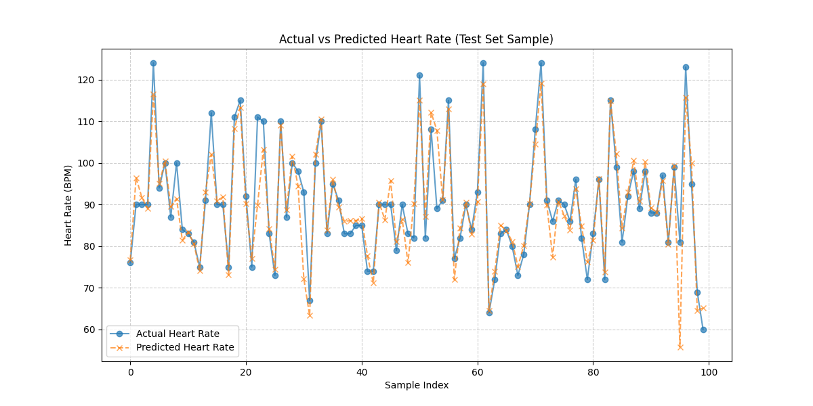

# PPG Heart Rate Prediction App

**Author:** Rohit  
**Stack:** Python, TensorFlow / Keras, Flask, NumPy, Pandas, Matplotlib

---

## About the Project

I wanted to go beyond just training a model in a notebook. The goal for this project was to build something end-to-end: a deep learning model that reads raw PPG (photoplethysmogram) sensor signals and predicts heart rate in BPM, wrapped inside a real Flask web app that anyone can interact with.

PPG is the same signal your smart watch sensor  measures when it detects your heartbeat through your wrist. I used the BIDMC dataset, which contains 53 real ICU patient recordings synchronized at 125Hz.

---

## How It Works

The data pipeline was honestly the trickiest part. Raw PPG is a continuous stream of voltage readings. To feed it into a neural network, I slice the signal into 8-second overlapping windows (1000 samples each, since the sampling rate is 125Hz). The key detail I had to get right was making these windows look back — each window ends at the timestamp of a known heart rate reading, so the model learns to associate the preceding 8 seconds of waveform with the correct BPM label.

Every window is then z-score normalized (zero mean, unit standard deviation) to remove the influence of sensor calibration differences between patients.

### Data Augmentation

To increase the dataset size without collecting more recordings, I applied three augmentation strategies — but only on the training set. This is important. Augmenting before splitting would leak synthetic test data and inflate accuracy numbers.

- Gaussian noise injection (std = 0.05)
- Random amplitude scaling (between 0.9x and 1.1x)
- Random time shifts (rolling the array by ±15 samples)

This grows each original training sample into 4 variants, tripling the effective training set size.

### Model Architecture

The model is a 3-block 1D CNN followed by two fully connected dense layers:

| Layer | Filters / Nodes | Kernel | Notes |
| :--- | :--- | :--- | :--- |
| Conv1D Block 1 | 64 filters | 7 | BatchNorm, ReLU, MaxPool, Dropout 0.3 |
| Conv1D Block 2 | 128 filters | 5 | BatchNorm, ReLU, MaxPool, Dropout 0.3 |
| Conv1D Block 3 | 256 filters | 3 | BatchNorm, ReLU, MaxPool, Dropout 0.4 |
| Dense 1 | 256 nodes | -- | L2 regularization, BatchNorm, Dropout 0.5 |
| Dense 2 | 128 nodes | -- | L2 regularization, BatchNorm, Dropout 0.5 |
| Output | 1 node | -- | Linear (regression) |

**Optimizer:** Adam with Exponential Decay (initial lr = 0.001, decay rate = 0.9 every 1000 steps)  
**Loss Function:** Huber Loss

I chose Huber Loss over MSE specifically because of motion artifacts. In real patient data, there are occasional spikes where the PPG signal is noisy or someone moved. MSE would square those large errors and let them dominate the gradient update. Huber Loss behaves like MSE for small errors but caps the penalty for large outliers, which was a noticeable improvement in stability.

**Training:** Up to 150 epochs with Early Stopping (patience = 15, monitoring validation loss, restoring best weights).

### Why Mean Absolute Error (MAE) as the Metric?

I use MAE to report performance rather than loss, because it puts the error in the same unit as the prediction (BPM). "The model is off by ~3.5 BPM on average" is something a doctor can understand if i simplify it can make mistake of ~3.5 beats per minute on average  . A Huber loss of 0.24 is not.

### Results

- **Test Mean Absolute Error: ~3.5 BPM** on unseen patient sequences.



### Flask API

The trained model is served via a REST endpoint at `/predict`. It expects a JSON payload with a `ppg_signal` array of exactly 1000 float values. The API validates the length strictly, z-score normalizes the input, and returns the predicted BPM rounded to one decimal place.

```json
POST /predict
{ "ppg_signal": [0.12, -0.34, ..., 0.89] }

{ "heart_rate": 72.3 }
```

---

## Project Structure

```
ppg-heart-rate-app/
├── main.py           # Data loading, augmentation, model training, and saving
├── app.py            # Flask REST API and frontend routing
├── plot_model.py     # Generates the actual vs predicted BPM chart from saved weights
├── test_app.py       # Pytest unit tests for the API endpoints
├── templates/
│   └── index.html    # Frontend dashboard (HTML/CSS, Chart.js)
├── requirements.txt  # Python dependencies
├── Dockerfile        # Container setup
├── .dockerignore     # Excludes large dataset files from the image
└── plots/            # Generated evaluation charts
```

---

## How to Run It

### 1. Install dependencies
```bash
pip install -r requirements.txt
```

### 2. Train the model
You need the BIDMC dataset in a `bidmc_csv/` folder (Signals and Numerics subfolders).
```bash
python main.py
```
This trains the model and saves `hr_model.keras`.

### 3. Start the web server
```bash
python app.py
```
Open `http://localhost:5000` in your browser.

### 4. Run unit tests
```bash
python -m pytest test_app.py
```

### 5. Docker
```bash
docker build -t ppg-dashboard .
docker run -p 5000:5000 ppg-dashboard
```

---

## Note from the student

Getting the temporal alignment right — making sure each window looks backward to match the correct heart rate label — took me a while to figure out. Once I understood it, everything clicked. The Huber Loss decision also came from noticing the training loss was spiking erratically, and switching from MSE solved it almost immediately.

# For future work of this project 

I would like to depoly this model on cloud platform and make it accessible to users through a mobile app. 


#------------------------------- Thanks -------------------------------
                    I hope this readme helps you 
